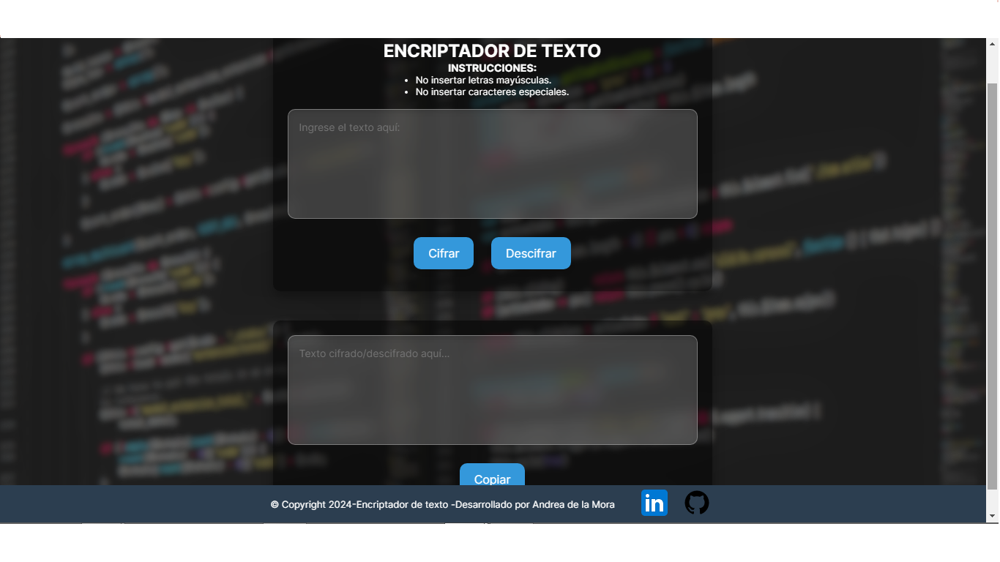

# encriptador_challenge
Encriptador de texto. Challenge Alura.

<h1 align="center"> Challenge encriptador de texto Alura </h1>

<h2>Descripción</h2>

Este proyecto es un encriptador de texto desarrollado como parte de un reto del programa de enseñanza de Alura. La aplicación permite cifrar y descifrar textos utilizando un sistema simple de sustitución de caracteres. Es una herramienta ideal para aprender los conceptos básicos de manipulación de strings en JavaScript, así como para aplicar buenas prácticas de desarrollo web con HTML y CSS.

<h2>Funcionalidades</h2>
<ul>
  <li> 🔑<b>Cifrado de Texto:</b> Convierte cada vocal en una secuencia de caracteres para proteger la información.</li>
  <li>🔓 <b>Descifrado de Texto:</b> Revierte el proceso de cifrado para recuperar el texto original.</li>
  <li>📋 <b>Copiar al Portapapeles:</b> Permite copiar el texto cifrado o descifrado directamente al portapapeles para un uso rápido.</li>
</ul>

<h2>Tecnologías Utilizadas</h2>
<ul>
  <li><b>HTML5:</b>Estructura del contenido de la aplicación.</li>
  <li><b>CSS</b></li>
  <li><b>JavaScript</b>Lógica de cifrado, descifrado y manipulación del DOM.</li>
</ul>

<h2>Uso</h2>
<ol>
  <li>Escribe el texto que deseas cifrar o descifrar en el área de texto correspondiente.</li>
  <li>Haz clic en el botón "Cifrar" para encriptar el texto o "Descifrar" para revertir el proceso.</li>
  <li>Utiliza el botón "Copiar" para copiar el resultado al portapapeles.</li>
</ol>

